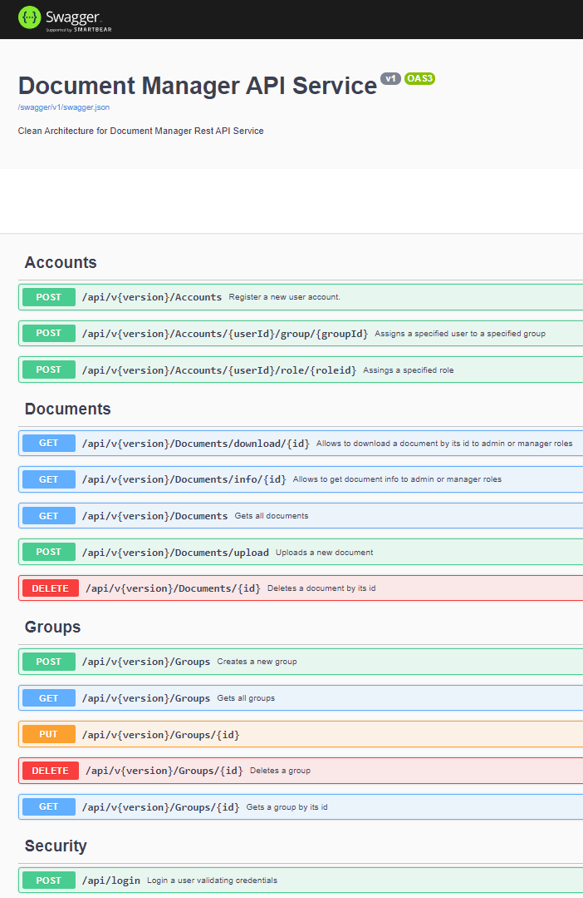
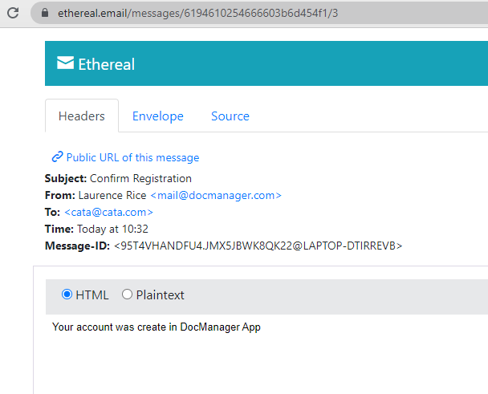
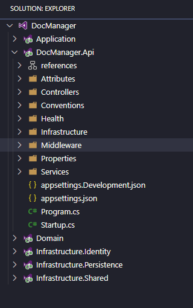

# Document Manager Rest API
## ASP.NET Core 3.1 Web API - Clean Architecture 

This is a clean-architecture solution with loosely-coupled, inverted-dependency and many more essential features.

Features:

[x] CQRS with MediatR

[x] Repository Pattern

[x] Npgsql and ADO.NET-compatible

[x] Repository Pattern

[x] MediatR Pipeline Logging & Validation

[x] Serilog

[x] Swagger UI

[x] Response Wrappers

[x] Healthchecks

[x] Pagination

[x] Microsoft Identity with JWT Authentication

[x] Role based Authorization

[x] Database Seeding

[x] Custom Exception Handling Middleware.

[x] API Versioning

[x] User - Role - Group Management (Register/Confirmation Email)


This is the Swagger documentation:



Example of confirmation email, when an account is registered:



The resouces are grouped as follows:

* Accounts: Creates a new account, assign roles and groups.
* Documents: Allows to upload, download and retrives metadata files.
* Groups: Creates and update groups.
* Secutiry: Allows Login and generate token.

Below, how the solution structure looks like.

 


There are the list of components:

* Domain: Contains all the entities and it does not depends on anything else.
* Application: Contains Interfaces, Validators (FluentValidation), Mapping (AutoMapper), CQRS (MediatR), Behaviors, etc.
* Infraestructure: Contains three components.
    * Persistence: Contains all data access.
    * Identity: Injects authentication and JWToken
    * Shared: Manage some services as Mail Service and Date Time Service
* Api: The presentation layer.

## How to run the app?
* Ensure the connectionstring in the __appsettings.json__ file is correct.
* Run the __InitialMigration.sql__ script which initialize the database objects (tables, index, procedures)


Finally, from the root folder execute the following command:

```
dotnet "run" "--project" "c:\Source\repos\DocManager\DocManager.Api\DocManager.Api.csproj" 
```

To debug just press __F5__ keyboard.

The following URLs will be available:

* Swagger documentation: https://localhost:5001/swagger
* Healthcheck: https://localhost:5001/health
